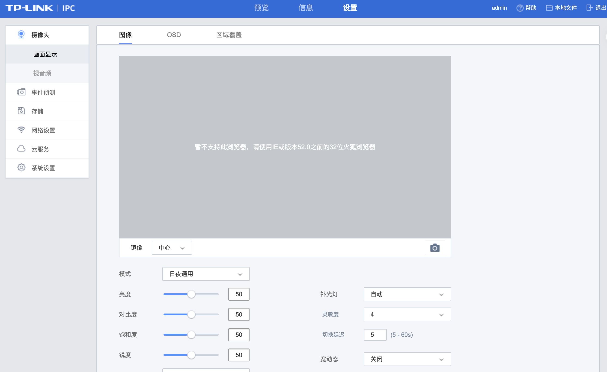
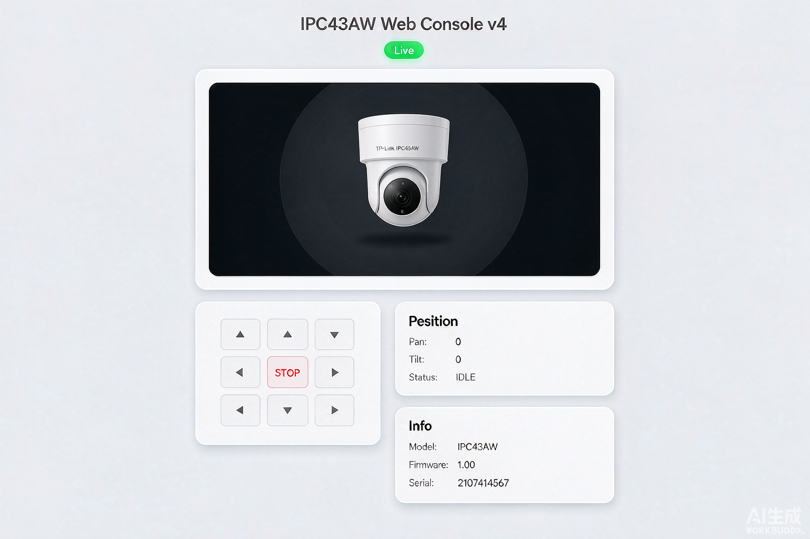

# TP-Link IPC43AW Web Console

一个轻量级的 TP-Link IPC43AW 摄像头 Web 控制台，用于解决官方 Web 界面在 Chrome / Edge / Firefox 等现代浏览器上无法查看视频的问题。


## 问题背景

TP-Link IPC 系列摄像头（如 IPC43AW）的自带管理页面仍依赖 NPAPI/ActiveX 插件，打开预览画面时常见如下提示：



现代浏览器已不再支持这些插件，因此需要一条不依赖浏览器插件的视频通路。本项目通过 ONVIF 获取摄像头 RTSP 流，再用 [go2rtc](https://github.com/AlexxIT/go2rtc) 将其转成分发为 WebRTC/FLV/HLS 等现代浏览器可直接播放的格式，从而在任意浏览器中查看画面并控制云台。

## 功能特性

- 配置文件驱动，无需改动代码即可切换摄像头
- 自动通过 ONVIF 发现 RTSP 地址
- 自动生成 go2rtc 配置并启动流媒体服务
- 浏览器内嵌 WebRTC 实时预览
- 按住方向键连续云台（PTZ）控制，松开即停止
- 实时显示云台坐标与设备信息
- 响应式极简 UI

## 配置说明

### 1. `config/camera.json`

摄像头与服务器基础配置：

```json
{
  "camera": {
    "ip": "192.168.0.97",
    "onvif_port": 2020,
    "username": "admin",
    "password": "admin"
  },
  "server": {
    "port": 8080
  },
  "ptz": {
    "reverse_x": false,
    "reverse_y": false
  }
}
```

| 字段 | 说明 |
|------|------|
| `camera.ip` | 摄像头 IP 地址 |
| `camera.onvif_port` | ONVIF 服务端口，TP-Link IPC 常见为 `2020` |
| `camera.username` | 登录用户名 |
| `camera.password` | 登录密码 |
| `server.port` | Web 控制台服务端口 |
| `ptz.reverse_x` | 水平方向是否反转 |
| `ptz.reverse_y` | 垂直方向是否反转 |

### 2. `config/go2rtc.yaml`

由程序首次启动时自动生成，无需手动修改。其作用是告诉 go2rtc 从哪里拉取 RTSP 流并对外提供 WebRTC 播放：

```yaml
streams:
  ipc:
    - rtsp://192.168.0.97:554/stream1

api:
  listen: 127.0.0.1:1984
```

`streams.ipc` 里的 RTSP 地址会在 `app.py` 启动时通过 ONVIF `GetStreamUri` 自动获取并覆盖写入该文件；如自动获取失败，可手动填写后再启动。

## 运行环境

- Python 3.9+
- macOS / Linux / Windows 均可（脚本内会自动下载对应平台的 go2rtc 二进制）

## 安装与运行

```bash
pip install -r requirements.txt
python app.py
```

首次启动时会：
1. 读取 `config/camera.json` 中的摄像头信息；
2. 通过 ONVIF 获取 RTSP 流地址；
3. 写入 `config/go2rtc.yaml`；
4. 自动下载 go2rtc 并启动流媒体服务；
5. 打开 Flask Web 控制台。

## 访问控制台

打开浏览器访问：

```
http://localhost:8080
```

页面效果示意：



页面包含：
- 实时视频预览窗口
- PTZ 方向控制（支持鼠标按住与触摸屏）
- 当前云台坐标
- 摄像头型号 / 固件版本 / 序列号

## 项目结构

```
.
├── app.py                 # Flask 后端主程序
├── config/
│   ├── camera.json        # 摄像头与服务器配置
│   └── go2rtc.yaml        # go2rtc 流媒体配置（自动生成/覆盖）
├── docs/                  # 文档图片
├── runtime/               # go2rtc 二进制与运行时文件
├── templates/
│   └── index.html         # Web 控制台前端页面
├── requirements.txt       # Python 依赖
└── README.md              # 本文件
```

## 常见问题

**Q: 浏览器提示“此网站无法提供安全连接”怎么办？**  
A: 视频 iframe 通过 `http://localhost:1984` 加载，只要主页面也通过 `http://localhost:8080` 访问就不会触发 HTTPS 混合内容限制。

**Q: 画面始终黑屏？**  
A: 检查摄像头 IP、用户名密码、ONVIF 端口是否正确；确认本机能直接访问摄像头 RTSP 端口（默认 554）。

**Q: 云台方向反了？**  
A: 修改 `config/camera.json` 中的 `ptz.reverse_x` 或 `ptz.reverse_y` 为 `true`，重启即可。
